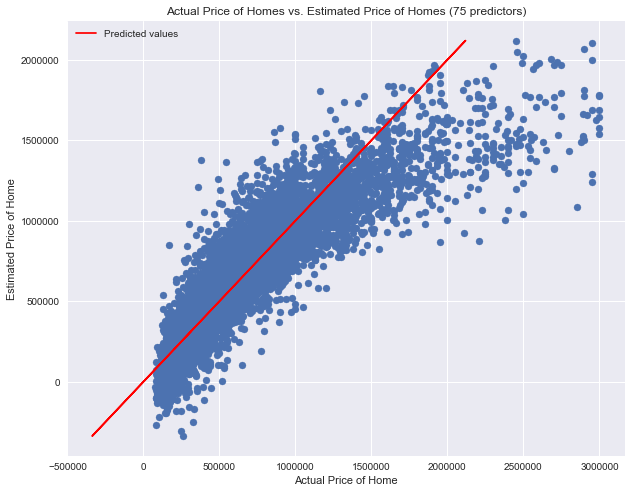

## Introduction

For this project I will be using a dataset for real estate prices in King's County, Washington. I will be using the OSEMN model for processing, detailed below:

O - Obtain:
    This step involves importing data and all relevant libraries.
S - Scrub:
    During this step we will identify and fill null values and clean our data.
E - Explore:
    This step can be mixed with scrubbing.  Here we will investigate our data and look for patterns.
M - Model:
    Here we will use our data to build a model to predict our target variable.
N - iNterpret:
    Finally we will interpret the results of our model and communicate our findings to stakeholders.
    
My goal is to identify the best and worst factors in house sale prices for real estate listings in King's County. The data contains information on house prices, date of sale and descriptive features of the houses (number of bedrooms, number of bathrooms, sq. footage, etc). I will be using a multivariate linear regression to find the importance of each feature on house prices. For a deeper look at my code and analysis, check out the notebook in this repository.

## EDA 

Before modeling I looked at the interactions between some of the variables to see if there will be any correlation issues. First, I looked at the sqft_living and sqft_living15 columns. These represent the living space of each home and the average living space of a home's closest 15 neighbors. Neighborhoods tend to have similarly sized homes, so I expected high correlation between these two variables.

There is a definite correlation here, though a smaller effect than I expected. I will need to account for this correlation during modeling. To further investigate the relationship between each house and its neighbors I looked at the sqft_lot and sqft_lot15 columns which represent land lot size for a house and the average lot size for that house's neighbors.

Here we see a very strong correlation. It seems that neighborhoods divide up land lots to be roughly the same size, even if the houses themselves are not. Finally, I wanted to look at look at how the waterfront and view columns interact. I expected that waterfront houses would generally have a better view.

As expected, waterfront seems to be one of the most determining factors for view.

## Modeling

Before actually running a model, I calculated the correlation between categories, then ended up dropping the sqft_living and sqft_lot15 columns to solve most of the correlation problems. Then I created a function that would drop factors out of our model that don't have a significant effect. There was a total of 82 factors in our model, and the selector function ended up using 72 features for the final model. Here is a result of the regression output:

I have an R-squared score of .77, indicating that the model explains 77% of the variance in the data. All of the p-values are well below .05 meaning our model is significant as well as reliable. When looking at the results of the model, it is easy to see that the reliability of the model decreases when the price of homes increases past $3,000,000. I decided to drop the homes that sold for more 3 million dollars and rerun the model to see if I can get a more reliable model. Here are the results of this model:

The R-squared score improved to .796 meaning the model explains about 80% of the variance in the house prices. When looking at the strengths of our individual factors, the two strongest features for improving sale price was being located in zip code 98039 or being located on the waterfront. The strongest negative feature was being located in zip code 98092.

## Summary

Using the OSEMN process, I created a multivariate linear regression model to predict house prices in Kings County, Washington. Correlations between variables were explored, and some variables were dropped due to high collinearity. A stepwise selector was used to filter our variables further and only use columns that produced a significant effect. The resulting model produced an R-squared of .77 showing a reasonably well fit model. To improve the model further, I capped the sale price of homes at $3,000,000. The resulting model was more reliable in predicting homes below the price cap with an r-squared value of .796. The strongest features in both positive and negative directions centered on location. Waterfront property was worth more than non-waterfront property and certain zip codes had much higher or lower price points.

## Future Work

Finally, I have do have a few recommendations for anyone looking to expand the scope of this project. The model did not function well for homes above $3,000,000 and that is the first thing that I would try to resolve. There have to be some consistent features among homes in this price bracket and a model to accurately predict their prices would be extremely advantageous to realtors and real estate investors. Next, I would look at further breaking down location information. We could try finding information by neighborhood rather than by zip code, or possibly binning the longitude and latitude. Finally, I would try to incorporate more predictors. Look for information on crime rates, school districts, and transportation (highways, public transportation lines). There are more features that buyers look for than just physical attributes.